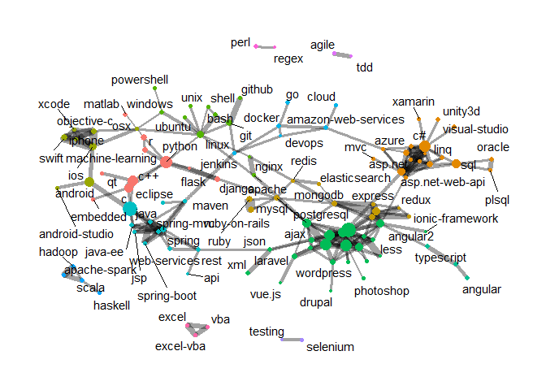
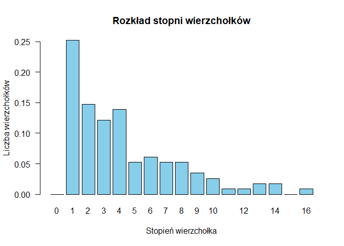
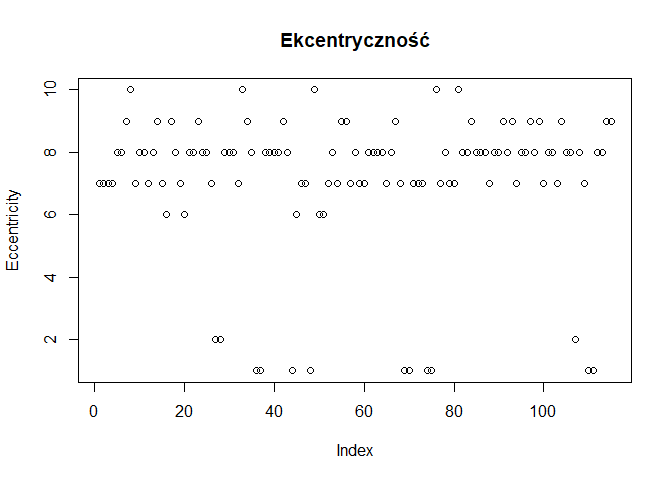
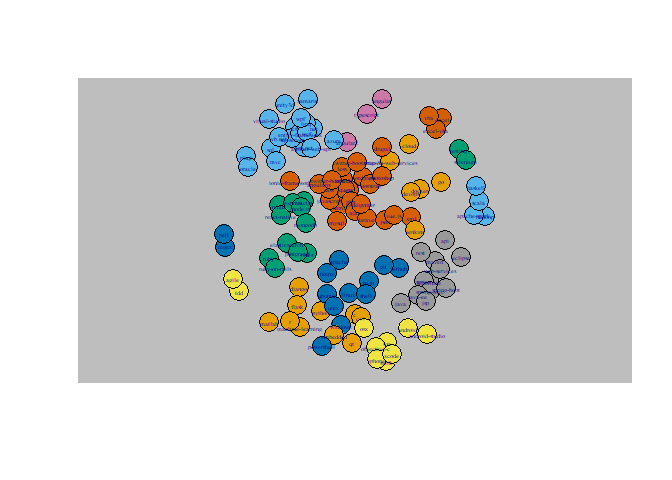
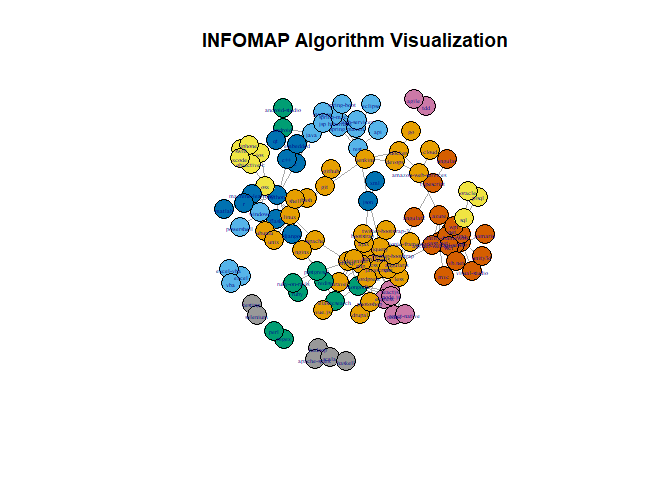
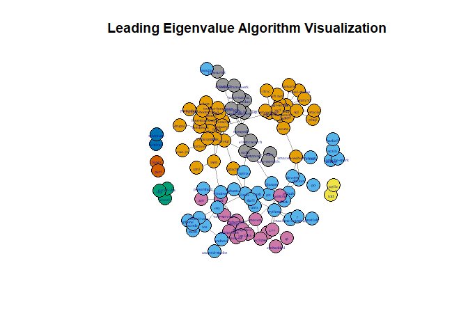

Graph analysis using the library(igraph)
================
Antoniuk
2024-06-29

``` r
library(igraph)
```

    ## 
    ## Attaching package: 'igraph'

    ## The following objects are masked from 'package:stats':
    ## 
    ##     decompose, spectrum

    ## The following object is masked from 'package:base':
    ## 
    ##     union

``` r
library(dplyr)
```

    ## 
    ## Attaching package: 'dplyr'

    ## The following objects are masked from 'package:igraph':
    ## 
    ##     as_data_frame, groups, union

    ## The following objects are masked from 'package:stats':
    ## 
    ##     filter, lag

    ## The following objects are masked from 'package:base':
    ## 
    ##     intersect, setdiff, setequal, union

``` r
edges <- read.csv("stack_network_links.csv")
nodes <- read.csv("stack_network_nodes.csv")
edges 
```

    ##                  source              target     value
    ## 1                 azure                .net  20.93319
    ## 2            sql-server                .net  32.32252
    ## 3               asp.net                .net  48.40703
    ## 4      entity-framework                .net  24.37090
    ## 5                   wpf                .net  32.35093
    ## 6                  linq                .net  20.50174
    ## 7                   wcf                .net  28.07440
    ## 8                    c#                .net  62.16790
    ## 9                   tdd               agile  37.14659
    ## 10          codeigniter                ajax  23.19190
    ## 11               jquery                ajax  50.56673
    ## 12                mysql                ajax  24.80009
    ## 13                  css                ajax  26.61371
    ## 14                  php                ajax  28.01068
    ## 15           javascript                ajax  24.39914
    ## 16                 json                ajax  32.94745
    ## 17                cloud amazon-web-services  21.31861
    ## 18                azure amazon-web-services  21.30995
    ## 19               devops amazon-web-services  24.98353
    ## 20               docker amazon-web-services  32.19807
    ## 21                  ios             android  39.77804
    ## 22       android-studio             android  33.66108
    ## 23                 java             android  50.98473
    ## 24              android      android-studio  33.66108
    ## 25           typescript             angular  31.03648
    ## 26           typescript            angular2  38.87998
    ## 27            angularjs            angular2  26.03270
    ## 28      ionic-framework           angularjs  29.84045
    ## 29              reactjs           angularjs  31.62020
    ## 30              mongodb           angularjs  31.51071
    ## 31                  css           angularjs  22.21041
    ## 32                 sass           angularjs  20.42588
    ## 33    twitter-bootstrap           angularjs  24.15369
    ## 34           javascript           angularjs  39.37663
    ## 35              express           angularjs  24.43383
    ## 36              node.js           angularjs  47.56353
    ## 37               jquery           angularjs  30.34795
    ## 38      asp.net-web-api           angularjs  20.11310
    ## 39             angular2           angularjs  26.03270
    ## 40                html5           angularjs  23.08266
    ## 41                nginx              apache  48.58317
    ## 42                mysql              apache  29.09783
    ## 43                linux              apache  28.16821
    ## 44                scala        apache-spark  50.79185
    ## 45               hadoop        apache-spark  59.82679
    ## 46                 rest                 api  22.17559
    ## 47                 .net             asp.net  48.40703
    ## 48                  sql             asp.net  21.67226
    ## 49           sql-server             asp.net  59.67329
    ## 50                   c#             asp.net  80.44854
    ## 51      asp.net-web-api             asp.net  47.38627
    ## 52               jquery             asp.net  28.72318
    ## 53     entity-framework             asp.net  48.11367
    ## 54                  mvc             asp.net  22.82841
    ## 55                azure             asp.net  23.76407
    ## 56                  wpf             asp.net  28.15902
    ## 57                 linq             asp.net  31.58128
    ## 58                  wcf             asp.net  40.95142
    ## 59               vb.net             asp.net  23.71135
    ## 60              asp.net     asp.net-web-api  47.38627
    ## 61                azure     asp.net-web-api  21.58569
    ## 62                   c#     asp.net-web-api  26.74882
    ## 63            angularjs     asp.net-web-api  20.11310
    ## 64           sql-server     asp.net-web-api  25.67647
    ## 65                  wcf     asp.net-web-api  28.35654
    ## 66     entity-framework     asp.net-web-api  31.18350
    ## 67                 .net               azure  20.93319
    ## 68                   c#               azure  22.14449
    ## 69      asp.net-web-api               azure  21.58569
    ## 70              asp.net               azure  23.76407
    ## 71  amazon-web-services               azure  21.30995
    ## 72                linux                bash  38.88812
    ## 73                shell                bash  24.71707
    ## 74                  git                bash  27.09696
    ## 75               jquery           bootstrap  22.40615
    ## 76                  css           bootstrap  24.71031
    ## 77                  c++                   c  80.89105
    ## 78               python                   c  22.32043
    ## 79             embedded                   c  28.40365
    ## 80                 java                   c  26.04946
    ## 81                 linq                  c#  25.22293
    ## 82                  sql                  c#  25.61390
    ## 83              asp.net                  c#  80.44854
    ## 84      asp.net-web-api                  c#  26.74882
    ## 85     entity-framework                  c#  30.72843
    ## 86               vb.net                  c#  25.18514
    ## 87                 .net                  c#  62.16790
    ## 88           sql-server                  c#  45.91465
    ## 89              xamarin                  c#  24.67315
    ## 90                azure                  c#  22.14449
    ## 91                  wpf                  c#  38.95749
    ## 92              unity3d                  c#  25.00023
    ## 93                  wcf                  c#  29.29988
    ## 94        visual-studio                  c#  27.71554
    ## 95                   qt                 c++  30.14466
    ## 96                    c                 c++  80.89105
    ## 97                 java                 c++  23.20110
    ## 98               python                 c++  24.30105
    ## 99  amazon-web-services               cloud  21.31861
    ## 100               mysql         codeigniter  22.59689
    ## 101              jquery         codeigniter  26.72977
    ## 102             laravel         codeigniter  31.65871
    ## 103                 php         codeigniter  37.40150
    ## 104                ajax         codeigniter  23.19190
    ## 105           wordpress         codeigniter  25.13313
    ## 106                ajax                 css  26.61371
    ## 107               mysql                 css  27.01062
    ## 108           photoshop                 css  20.85572
    ## 109              jquery                 css  66.67421
    ## 110                html                 css 126.57113
    ## 111          javascript                 css  75.53660
    ## 112               html5                 css  87.13827
    ## 113           bootstrap                 css  24.71031
    ## 114   twitter-bootstrap                 css  31.56406
    ## 115                less                 css  25.34054
    ## 116           wordpress                 css  31.26482
    ## 117           angularjs                 css  22.21041
    ## 118                sass                 css  40.96336
    ## 119                 php                 css  51.44760
    ## 120 amazon-web-services              devops  24.98353
    ## 121              docker              devops  24.55420
    ## 122             jenkins              devops  23.60259
    ## 123              python              django  49.90594
    ## 124               flask              django  42.33664
    ## 125          postgresql              django  22.48925
    ## 126 amazon-web-services              docker  32.19807
    ## 127                  go              docker  28.37541
    ## 128              devops              docker  24.55420
    ## 129             jenkins              docker  26.52861
    ## 130           wordpress              drupal  24.91930
    ## 131               maven             eclipse  25.31466
    ## 132               redis       elasticsearch  29.34910
    ## 133             mongodb       elasticsearch  20.22801
    ## 134                   c            embedded  28.40365
    ## 135                .net    entity-framework  24.37090
    ## 136                 wpf    entity-framework  24.22820
    ## 137             asp.net    entity-framework  48.11367
    ## 138          sql-server    entity-framework  32.62378
    ## 139                linq    entity-framework  54.00593
    ## 140                 wcf    entity-framework  32.81595
    ## 141     asp.net-web-api    entity-framework  31.18350
    ## 142                  c#    entity-framework  30.72843
    ## 143                 vba               excel  45.26075
    ## 144           excel-vba               excel  54.50524
    ## 145                 vba           excel-vba  49.61622
    ## 146               excel           excel-vba  54.50524
    ## 147             reactjs             express  31.92427
    ## 148               redux             express  21.54346
    ## 149           angularjs             express  24.43383
    ## 150             node.js             express  58.82908
    ## 151             mongodb             express  48.76806
    ## 152              python               flask  25.25137
    ## 153              django               flask  42.33664
    ## 154             jenkins                 git  23.07544
    ## 155              github                 git  56.20246
    ## 156                bash                 git  27.09696
    ## 157               linux                 git  27.70879
    ## 158                 git              github  56.20246
    ## 159              docker                  go  28.37541
    ## 160               scala              hadoop  21.62593
    ## 161        apache-spark              hadoop  59.82679
    ## 162               scala             haskell  22.75744
    ## 163                 jsp           hibernate  39.40695
    ## 164                java           hibernate  32.52357
    ## 165         spring-boot           hibernate  30.23290
    ## 166               maven           hibernate  34.10005
    ## 167                rest           hibernate  21.64667
    ## 168        web-services           hibernate  21.21096
    ## 169          spring-mvc           hibernate  64.10990
    ## 170             java-ee           hibernate  39.90817
    ## 171              spring           hibernate 103.26828
    ## 172               mysql                html  21.35569
    ## 173          javascript                html  59.75549
    ## 174                 php                html  45.66104
    ## 175                 css                html 126.57113
    ## 176                sass                html  23.63953
    ## 177              jquery                html  44.23362
    ## 178                 php               html5  32.35051
    ## 179           wordpress               html5  22.21644
    ## 180          javascript               html5  47.00636
    ## 181           angularjs               html5  23.08266
    ## 182                less               html5  20.92319
    ## 183 twitter-bootstrap-3               html5  22.16104
    ## 184              jquery               html5  47.49277
    ## 185                 css               html5  87.13827
    ## 186   twitter-bootstrap               html5  26.23098
    ## 187                sass               html5  32.07038
    ## 188           angularjs     ionic-framework  29.84045
    ## 189             android                 ios  39.77804
    ## 190               swift                 ios  87.21964
    ## 191                 osx                 ios  30.34158
    ## 192         objective-c                 ios  78.75928
    ## 193              iphone                 ios  57.15857
    ## 194               xcode                 ios  46.36509
    ## 195               swift              iphone  36.02337
    ## 196               xcode              iphone  34.71287
    ## 197                 ios              iphone  57.15857
    ## 198         objective-c              iphone  47.97789
    ## 199              spring                java  43.95426
    ## 200                 c++                java  23.20110
    ## 201                 jsp                java  21.61980
    ## 202             java-ee                java  25.11618
    ## 203             android                java  50.98473
    ## 204           hibernate                java  32.52357
    ## 205                   c                java  26.04946
    ## 206          spring-mvc                java  25.04121
    ## 207              spring             java-ee  39.81211
    ## 208           hibernate             java-ee  39.90817
    ## 209          spring-mvc             java-ee  27.96459
    ## 210                java             java-ee  25.11618
    ## 211              jquery          javascript  57.84183
    ## 212   twitter-bootstrap          javascript  20.23882
    ## 213             node.js          javascript  42.73173
    ## 214               mysql          javascript  22.91619
    ## 215           angularjs          javascript  39.37663
    ## 216                 php          javascript  47.32816
    ## 217                ajax          javascript  24.39914
    ## 218             reactjs          javascript  33.56736
    ## 219                 css          javascript  75.53660
    ## 220                html          javascript  59.75549
    ## 221                sass          javascript  23.78247
    ## 222               html5          javascript  47.00636
    ## 223                 git             jenkins  23.07544
    ## 224              devops             jenkins  23.60259
    ## 225               maven             jenkins  33.47708
    ## 226              docker             jenkins  26.52861
    ## 227                json              jquery  20.62958
    ## 228                html              jquery  44.23362
    ## 229           wordpress              jquery  28.87017
    ## 230                sass              jquery  24.68173
    ## 231             asp.net              jquery  28.72318
    ## 232                 php              jquery  46.61909
    ## 233                 css              jquery  66.67421
    ## 234               html5              jquery  47.49277
    ## 235                ajax              jquery  50.56673
    ## 236   twitter-bootstrap              jquery  36.79193
    ## 237               mysql              jquery  35.71298
    ## 238           angularjs              jquery  30.34795
    ## 239 twitter-bootstrap-3              jquery  21.15324
    ## 240          javascript              jquery  57.84183
    ## 241         codeigniter              jquery  26.72977
    ## 242           bootstrap              jquery  22.40615
    ## 243                rest                json  25.04950
    ## 244              jquery                json  20.62958
    ## 245                 xml                json  42.72167
    ## 246                ajax                json  32.94745
    ## 247           hibernate                 jsp  39.40695
    ## 248                java                 jsp  21.61980
    ## 249          spring-mvc                 jsp  24.06449
    ## 250              spring                 jsp  30.61334
    ## 251              vue.js             laravel  28.79990
    ## 252                 php             laravel  45.88473
    ## 253               mysql             laravel  20.23027
    ## 254         codeigniter             laravel  31.65871
    ## 255                sass                less  60.54594
    ## 256                 css                less  25.34054
    ## 257               html5                less  20.92319
    ## 258                 wcf                linq  34.58709
    ## 259          sql-server                linq  20.44479
    ## 260                  c#                linq  25.22293
    ## 261             asp.net                linq  31.58128
    ## 262    entity-framework                linq  54.00593
    ## 263                .net                linq  20.50174
    ## 264                 wpf                linq  26.46839
    ## 265                bash               linux  38.88812
    ## 266                 git               linux  27.70879
    ## 267                unix               linux  25.35741
    ## 268                 osx               linux  23.41281
    ## 269              ubuntu               linux  29.89434
    ## 270               shell               linux  21.13179
    ## 271               nginx               linux  21.08048
    ## 272             windows               linux  29.94540
    ## 273              python               linux  21.17036
    ## 274              apache               linux  28.16821
    ## 275              python    machine-learning  30.27077
    ## 276                   r    machine-learning  23.21870
    ## 277                   r              matlab  20.02193
    ## 278          spring-mvc               maven  24.93380
    ## 279             jenkins               maven  33.47708
    ## 280             eclipse               maven  25.31466
    ## 281              spring               maven  39.53023
    ## 282           hibernate               maven  34.10005
    ## 283             express             mongodb  48.76806
    ## 284             node.js             mongodb  58.65781
    ## 285             reactjs             mongodb  22.32097
    ## 286          postgresql             mongodb  22.85556
    ## 287               mysql             mongodb  26.36926
    ## 288               redis             mongodb  33.55473
    ## 289       elasticsearch             mongodb  20.22801
    ## 290           angularjs             mongodb  31.51071
    ## 291             asp.net                 mvc  22.82841
    ## 292                 css               mysql  27.01062
    ## 293              jquery               mysql  35.71298
    ## 294             mongodb               mysql  26.36926
    ## 295             laravel               mysql  20.23027
    ## 296                 php               mysql  65.07026
    ## 297          postgresql               mysql  25.90994
    ## 298          javascript               mysql  22.91619
    ## 299                html               mysql  21.35569
    ## 300                ajax               mysql  24.80009
    ## 301              apache               mysql  29.09783
    ## 302         codeigniter               mysql  22.59689
    ## 303               linux               nginx  21.08048
    ## 304               redis               nginx  27.47314
    ## 305              apache               nginx  48.58317
    ## 306          javascript             node.js  42.73173
    ## 307             reactjs             node.js  55.19275
    ## 308             express             node.js  58.82908
    ## 309           angularjs             node.js  47.56353
    ## 310             mongodb             node.js  58.65781
    ## 311        react-native             node.js  22.16325
    ## 312               redux             node.js  23.40192
    ## 313               xcode         objective-c  43.41883
    ## 314              iphone         objective-c  47.97789
    ## 315               swift         objective-c  79.08854
    ## 316                 ios         objective-c  78.75928
    ## 317                 osx         objective-c  24.76319
    ## 318                 sql              oracle  21.82760
    ## 319               plsql              oracle  45.06151
    ## 320             windows                 osx  20.86025
    ## 321         objective-c                 osx  24.76319
    ## 322                 ios                 osx  30.34158
    ## 323               linux                 osx  23.41281
    ## 324               regex                perl  21.36408
    ## 325                 css           photoshop  20.85572
    ## 326                 css                 php  51.44760
    ## 327             laravel                 php  45.88473
    ## 328           wordpress                 php  41.03705
    ## 329              jquery                 php  46.61909
    ## 330          javascript                 php  47.32816
    ## 331                ajax                 php  28.01068
    ## 332                html                 php  45.66104
    ## 333               mysql                 php  65.07026
    ## 334               html5                 php  32.35051
    ## 335         codeigniter                 php  37.40150
    ## 336              oracle               plsql  45.06151
    ## 337                 sql               plsql  22.71744
    ## 338               mysql          postgresql  25.90994
    ## 339               redis          postgresql  26.28018
    ## 340       ruby-on-rails          postgresql  25.69011
    ## 341             mongodb          postgresql  22.85556
    ## 342              django          postgresql  22.48925
    ## 343                ruby          postgresql  21.79518
    ## 344             windows          powershell  20.24069
    ## 345               flask              python  25.25137
    ## 346                 c++              python  24.30105
    ## 347    machine-learning              python  30.27077
    ## 348              django              python  49.90594
    ## 349                   c              python  22.32043
    ## 350                   r              python  28.53575
    ## 351               linux              python  21.17036
    ## 352                 c++                  qt  30.14466
    ## 353              python                   r  28.53575
    ## 354              matlab                   r  20.02193
    ## 355    machine-learning                   r  23.21870
    ## 356             reactjs        react-native  61.53102
    ## 357               redux        react-native  25.48058
    ## 358             node.js        react-native  22.16325
    ## 359             node.js             reactjs  55.19275
    ## 360                sass             reactjs  24.99796
    ## 361        react-native             reactjs  61.53102
    ## 362               redux             reactjs  65.12986
    ## 363           angularjs             reactjs  31.62020
    ## 364             mongodb             reactjs  22.32097
    ## 365             express             reactjs  31.92427
    ## 366          javascript             reactjs  33.56736
    ## 367             mongodb               redis  33.55473
    ## 368               nginx               redis  27.47314
    ## 369       elasticsearch               redis  29.34910
    ## 370          postgresql               redis  26.28018
    ## 371             reactjs               redux  65.12986
    ## 372             node.js               redux  23.40192
    ## 373        react-native               redux  25.48058
    ## 374             express               redux  21.54346
    ## 375                perl               regex  21.36408
    ## 376              spring                rest  26.11760
    ## 377        web-services                rest  33.69067
    ## 378                 api                rest  22.17559
    ## 379           hibernate                rest  21.64667
    ## 380                json                rest  25.04950
    ## 381          postgresql                ruby  21.79518
    ## 382       ruby-on-rails                ruby  95.36131
    ## 383          postgresql       ruby-on-rails  25.69011
    ## 384                ruby       ruby-on-rails  95.36131
    ## 385              jquery                sass  24.68173
    ## 386          javascript                sass  23.78247
    ## 387             reactjs                sass  24.99796
    ## 388                html                sass  23.63953
    ## 389               html5                sass  32.07038
    ## 390                less                sass  60.54594
    ## 391           angularjs                sass  20.42588
    ## 392                 css                sass  40.96336
    ## 393   twitter-bootstrap                sass  20.18549
    ## 394              hadoop               scala  21.62593
    ## 395             haskell               scala  22.75744
    ## 396        apache-spark               scala  50.79185
    ## 397             testing            selenium  33.68594
    ## 398                bash               shell  24.71707
    ## 399               linux               shell  21.13179
    ## 400        web-services              spring  20.16561
    ## 401          spring-mvc              spring  63.33022
    ## 402                rest              spring  26.11760
    ## 403         spring-boot              spring  57.04039
    ## 404               maven              spring  39.53023
    ## 405             java-ee              spring  39.81211
    ## 406           hibernate              spring 103.26828
    ## 407                 jsp              spring  30.61334
    ## 408                java              spring  43.95426
    ## 409              spring         spring-boot  57.04039
    ## 410           hibernate         spring-boot  30.23290
    ## 411          spring-mvc         spring-boot  60.61683
    ## 412               maven          spring-mvc  24.93380
    ## 413             java-ee          spring-mvc  27.96459
    ## 414              spring          spring-mvc  63.33022
    ## 415                 jsp          spring-mvc  24.06449
    ## 416         spring-boot          spring-mvc  60.61683
    ## 417           hibernate          spring-mvc  64.10990
    ## 418                java          spring-mvc  25.04121
    ## 419               plsql                 sql  22.71744
    ## 420          sql-server                 sql  24.35477
    ## 421                  c#                 sql  25.61390
    ## 422              oracle                 sql  21.82760
    ## 423             asp.net                 sql  21.67226
    ## 424     asp.net-web-api          sql-server  25.67647
    ## 425                 wcf          sql-server  26.29147
    ## 426              vb.net          sql-server  21.78889
    ## 427                .net          sql-server  32.32252
    ## 428    entity-framework          sql-server  32.62378
    ## 429             asp.net          sql-server  59.67329
    ## 430                linq          sql-server  20.44479
    ## 431                 sql          sql-server  24.35477
    ## 432                  c#          sql-server  45.91465
    ## 433               xcode               swift  48.62033
    ## 434              iphone               swift  36.02337
    ## 435         objective-c               swift  79.08854
    ## 436                 ios               swift  87.21964
    ## 437               agile                 tdd  37.14659
    ## 438            selenium             testing  33.68594
    ## 439           angularjs   twitter-bootstrap  24.15369
    ## 440               html5   twitter-bootstrap  26.23098
    ## 441                sass   twitter-bootstrap  20.18549
    ## 442              jquery   twitter-bootstrap  36.79193
    ## 443          javascript   twitter-bootstrap  20.23882
    ## 444                 css   twitter-bootstrap  31.56406
    ## 445              jquery twitter-bootstrap-3  21.15324
    ## 446               html5 twitter-bootstrap-3  22.16104
    ## 447            angular2          typescript  38.87998
    ## 448             angular          typescript  31.03648
    ## 449               linux              ubuntu  29.89434
    ## 450                  c#             unity3d  25.00023
    ## 451               linux                unix  25.35741
    ## 452             asp.net              vb.net  23.71135
    ## 453          sql-server              vb.net  21.78889
    ## 454                  c#              vb.net  25.18514
    ## 455           excel-vba                 vba  49.61622
    ## 456               excel                 vba  45.26075
    ## 457                  c#       visual-studio  27.71554
    ## 458             laravel              vue.js  28.79990
    ## 459                .net                 wcf  28.07440
    ## 460    entity-framework                 wcf  32.81595
    ## 461                  c#                 wcf  29.29988
    ## 462          sql-server                 wcf  26.29147
    ## 463                 wpf                 wcf  53.17990
    ## 464                linq                 wcf  34.58709
    ## 465             asp.net                 wcf  40.95142
    ## 466     asp.net-web-api                 wcf  28.35654
    ## 467                rest        web-services  33.69067
    ## 468           hibernate        web-services  21.21096
    ## 469              spring        web-services  20.16561
    ## 470          powershell             windows  20.24069
    ## 471               linux             windows  29.94540
    ## 472                 osx             windows  20.86025
    ## 473                 php           wordpress  41.03705
    ## 474               html5           wordpress  22.21644
    ## 475                 css           wordpress  31.26482
    ## 476         codeigniter           wordpress  25.13313
    ## 477              drupal           wordpress  24.91930
    ## 478              jquery           wordpress  28.87017
    ## 479                linq                 wpf  26.46839
    ## 480                 wcf                 wpf  53.17990
    ## 481    entity-framework                 wpf  24.22820
    ## 482                  c#                 wpf  38.95749
    ## 483             asp.net                 wpf  28.15902
    ## 484                .net                 wpf  32.35093
    ## 485                  c#             xamarin  24.67315
    ## 486         objective-c               xcode  43.41883
    ## 487               swift               xcode  48.62033
    ## 488              iphone               xcode  34.71287
    ## 489                 ios               xcode  46.36509
    ## 490                json                 xml  42.72167

``` r
edges <- edges %>% distinct(value, .keep_all = TRUE)
```

``` r
library(readr)
library(igraph)
library(ggraph)
```

    ## Warning: package 'ggraph' was built under R version 4.3.2

    ## Loading required package: ggplot2

``` r
stack_network <- graph_from_data_frame(read_csv("stack_network_links.csv"),
                                       vertices = read_csv("stack_network_nodes.csv"))
```

    ## Rows: 490 Columns: 3

    ## ── Column specification ────────────────────────────────────────────────────────
    ## Delimiter: ","
    ## chr (2): source, target
    ## dbl (1): value
    ## 
    ## ℹ Use `spec()` to retrieve the full column specification for this data.
    ## ℹ Specify the column types or set `show_col_types = FALSE` to quiet this message.
    ## Rows: 115 Columns: 3
    ## ── Column specification ────────────────────────────────────────────────────────
    ## Delimiter: ","
    ## chr (1): name
    ## dbl (2): group, nodesize
    ## 
    ## ℹ Use `spec()` to retrieve the full column specification for this data.
    ## ℹ Specify the column types or set `show_col_types = FALSE` to quiet this message.

``` r
set.seed(2017)
ggraph(stack_network, layout = "fr") +
  geom_edge_link(alpha = 0.2, aes(width = value)) +
  geom_node_point(aes(color = as.factor(group), size = 10 * nodesize)) +
  geom_node_text(aes(label = name), repel = TRUE) +
  theme_graph() +
  theme(legend.position="none")
```

    ## Warning: Using the `size` aesthetic in this geom was deprecated in ggplot2 3.4.0.
    ## ℹ Please use `linewidth` in the `default_aes` field and elsewhere instead.
    ## This warning is displayed once every 8 hours.
    ## Call `lifecycle::last_lifecycle_warnings()` to see where this warning was
    ## generated.

    ## Warning: ggrepel: 22 unlabeled data points (too many overlaps). Consider
    ## increasing max.overlaps

<!-- -->

``` r
graf <- graph.data.frame(edges, directed = FALSE, vertices = nodes)
V(graf)$label <- nodes$name
```

**Zad 2**

``` r
# Sprawdź, czy graf jest spójny
is_connected(graf)
```

    ## [1] FALSE

``` r
#Składowe spójne w grafie
components <- clusters(graf)
cat("Rozmiary komponentów:", components$csize, "\n")
```

    ## Rozmiary komponentów: 102 4 3 2 2 2

``` r
cat("Liczba komponentów:", components$no, "\n")
```

    ## Liczba komponentów: 6

``` r
# Liczba wierzchołków
length(V(graf))
```

    ## [1] 115

``` r
# Liczba krawędzi
length(E(graf))
```

    ## [1] 245

``` r
# Średni stopień wierzchołka
mean(degree(graf))
```

    ## [1] 4.26087

``` r
# Średnia droga charakterystyczna (długość najkrótszej ścieżki między dwoma wierzchołkami)
average.path.length(stack_network)
```

    ## [1] 4.500097

``` r
# Gęstość grafu
graph.density(graf)
```

    ## [1] 0.03737605

``` r
# Średnica grafu skierowanego
diameter(graf, directed = TRUE, weights = NA)
```

    ## [1] 10

``` r
# Histogram stopni wierzchołków
hist(degree(graf), main = "Rozkład stopni wierzchołków", xlab = "Stopień wierzchołka", ylab = "Liczba wierzchołków",col = "skyblue")
```

<!-- -->

``` r
# Wizualizacja z kolorowaniem wierzchołków według stopni
plot(graf, layout = layout.fruchterman.reingold, vertex.label.cex = 0.4, edge.arrow.size = 0.7, vertex.color = degree(graf))
```

<!-- -->

**Zad 3**

``` r
# Stopnie wierzcholków
dg_all <-  degree(graf)
order_indices <- order(-dg_all)  
sorted_dg <- dg_all[order_indices]
cat("10 wierzchołków o najwyższym stopniu: \n")
```

    ## 10 wierzchołków o najwyższym stopniu:

``` r
head(sorted_dg,5)
```

    ##    jquery       css        c#   asp.net angularjs 
    ##        16        14        14        13        13

``` r
print(sorted_dg[6:10])
```

    ## javascript      mysql      html5        php      linux 
    ##         12         11         10         10         10

``` r
cat("10 wierzchołków o najniższym stopniu: \n")
```

    ## 10 wierzchołków o najniższym stopniu:

``` r
tail(sorted_dg, 10)[1:5]
```

    ## xamarin     mvc haskell     api   regex 
    ##       1       1       1       1       1

``` r
tail(sorted_dg,5)
```

    ##       perl      cloud  photoshop powershell     matlab 
    ##          1          1          1          1          1

``` r
high_degree_vertices <- head(order_indices, 10)
low_degree_vertices <- tail(order_indices, 10)
vertex_labels <- V(graf)$name
vertex_colors <- ifelse(V(graf)$name %in% vertex_labels[high_degree_vertices], "red", 
                        ifelse(V(graf)$name %in% vertex_labels[low_degree_vertices], "blue", "gray"))
png("plot11.png", width = 800, height = 600)
plot(graf, layout = layout_with_fr, vertex.label = vertex_labels, vertex.label.cex = 0.3, 
     vertex.color = vertex_colors)
legend("topright", legend = c("Wysoki stopień", "Niski stopień", "Inne"),
       col = c("red", "blue", "gray"), pch = 18)
dev.off()
```

    ## png 
    ##   2

``` r
#Obszar z największym stopniem
V(graf)$label[which(dg_all == max(dg_all))]
```

    ## [1] "jquery"

``` r
#Obszary z najmniejszym stopniem
V(graf)$label[which(dg_all == min(dg_all))]
```

    ##  [1] "github"          "xml"             "tdd"             "agile"          
    ##  [5] "testing"         "selenium"        "android-studio"  "angular"        
    ##  [9] "qt"              "ubuntu"          "ionic-framework" "vue.js"         
    ## [13] "embedded"        "go"              "visual-studio"   "unix"           
    ## [17] "eclipse"         "unity3d"         "drupal"          "xamarin"        
    ## [21] "mvc"             "haskell"         "api"             "regex"          
    ## [25] "perl"            "cloud"           "photoshop"       "powershell"     
    ## [29] "matlab"

``` r
#Posortowane obszary za stopniem
head(V(graf)$label[order(dg_all, decreasing = T)],10)
```

    ##  [1] "jquery"     "css"        "c#"         "asp.net"    "angularjs" 
    ##  [6] "javascript" "mysql"      "html5"      "php"        "linux"

``` r
# Wykres słupkowy rozkładu stopni wierzchołków
barplot(degree.distribution(graf), 
        col = "skyblue",            
        main = "Rozkład stopni wierzchołków", 
        xlab = "Stopień wierzchołka",  
        ylab = "Liczba wierzchołków",  
        border = "black",           
        names.arg = 0:(length(degree.distribution(graf))-1),  
        las = 1)
```

<!-- -->

``` r
#Pośrednictwo
bw <- betweenness(graf)
#Plot
plot(bw, type = "p", main = "Pośrednictwo",xlab = "Index", ylab = "Betweenness")
```

<!-- -->

``` r
dev.copy(png, filename = "plot.png")
```

    ## png 
    ##   3

``` r
dev.off()
```

    ## png 
    ##   2

``` r
#Wierzchołek z największym pośrednictwom
V(graf)$label[which(bw==max(bw))]
```

    ## [1] "jquery"

``` r
#Wierzchołki z najmniejszym pośrednictwom
V(graf)$label[which(bw==min(bw))]
```

    ##  [1] "ruby"                "ruby-on-rails"       "swift"              
    ##  [4] "react-native"        "spring-boot"         "less"               
    ##  [7] "hadoop"              "apache-spark"        "iphone"             
    ## [10] "github"              "excel"               "excel-vba"          
    ## [13] "wpf"                 "vba"                 "xcode"              
    ## [16] "plsql"               "oracle"              "xml"                
    ## [19] "flask"               "java-ee"             "jsp"                
    ## [22] "tdd"                 "agile"               "twitter-bootstrap"  
    ## [25] "web-services"        "testing"             "selenium"           
    ## [28] "android-studio"      "angular"             "machine-learning"   
    ## [31] "qt"                  "ubuntu"              "ionic-framework"    
    ## [34] "elasticsearch"       "vue.js"              "embedded"           
    ## [37] "go"                  "visual-studio"       "unix"               
    ## [40] "eclipse"             "vb.net"              "unity3d"            
    ## [43] "drupal"              "shell"               "bootstrap"          
    ## [46] "xamarin"             "mvc"                 "haskell"            
    ## [49] "api"                 "twitter-bootstrap-3" "regex"              
    ## [52] "perl"                "cloud"               "photoshop"          
    ## [55] "powershell"          "matlab"

``` r
#Bliskość
cl <- closeness(graf)
#Plot
plot(cl, type = "p", main = "Bliskość", xlab = "Index", ylab = "Closeness")
```

<!-- -->

``` r
dev.copy(png, filename = "plot1.png")
```

    ## png 
    ##   3

``` r
dev.off()
```

    ## png 
    ##   2

``` r
#Wierzchołki z największą bliskościu
V(graf)$label[which(cl==max(cl))]
```

    ## [1] "tdd"      "agile"    "testing"  "selenium" "regex"    "perl"

``` r
#Wierzchołek z najmniejszą bliskościu
V(graf)$label[which(cl==min(cl))]
```

    ## [1] "angular"

``` r
#Centralność wektora własnego
ec <- eigen_centrality(graf)
ec$vector
```

    ##                html                 css           hibernate              spring 
    ##        5.572733e-01        9.260358e-01        4.515325e-03        4.515325e-03 
    ##                ruby       ruby-on-rails                 ios               swift 
    ##        1.517217e-02        1.517217e-02        2.705694e-04        7.643229e-05 
    ##               html5                   c                 c++             asp.net 
    ##        7.330195e-01        6.881983e-04        6.881983e-04        3.096814e-01 
    ##                  c#         objective-c          javascript              jquery 
    ##        2.110691e-01        2.466080e-04        8.903006e-01        1.000000e+00 
    ##               redux             reactjs                 php               mysql 
    ##        1.116181e-01        3.764996e-01        7.253557e-01        6.543835e-01 
    ##          spring-mvc                .net        react-native         spring-boot 
    ##        1.854059e-03        1.650984e-01        9.057737e-02        1.241629e-03 
    ##                less                sass              hadoop        apache-spark 
    ##        2.678731e-01        6.892481e-01        0.000000e+00        0.000000e+00 
    ##          sql-server             express             node.js             mongodb 
    ##        1.790749e-01        2.054936e-01        3.059267e-01        2.823451e-01 
    ##              iphone              github                 git               excel 
    ##        7.643229e-05        1.972919e-04        1.729555e-03        0.000000e+00 
    ##           excel-vba    entity-framework                linq                 wcf 
    ##        0.000000e+00        1.764152e-01        1.544354e-01        1.764152e-01 
    ##                 wpf             android                java               scala 
    ##        1.360997e-01        2.340182e-04        1.754251e-03        0.000000e+00 
    ##                ajax              django              python                 vba 
    ##        5.457818e-01        1.407089e-02        3.512122e-03        0.000000e+00 
    ##               xcode              apache               nginx           angularjs 
    ##        7.643229e-05        7.791357e-02        1.621928e-02        7.250653e-01 
    ##     asp.net-web-api             laravel               plsql              oracle 
    ##        2.146657e-01        2.065326e-01        1.058984e-02        1.058984e-02 
    ##                json                 xml               flask           wordpress 
    ##        1.812429e-01        2.067454e-02        2.005710e-03        4.382221e-01 
    ##             java-ee               maven                 jsp                bash 
    ##        1.441738e-03        1.343563e-03        1.441738e-03        1.799689e-03 
    ##               linux            angular2          typescript         codeigniter 
    ##        1.242478e-02        8.381384e-02        9.686767e-03        4.072646e-01 
    ##                 tdd               agile   twitter-bootstrap        web-services 
    ##        0.000000e+00        0.000000e+00        5.662103e-01        3.585924e-03 
    ##                rest             testing            selenium      android-studio 
    ##        2.240527e-02        0.000000e+00        0.000000e+00        2.669467e-05 
    ##               redis             jenkins              docker amazon-web-services 
    ##        5.184755e-02        7.403420e-04        1.718573e-03        1.243095e-02 
    ##             angular                 osx    machine-learning                  qt 
    ##        1.104978e-03        1.662017e-03        4.529047e-04        7.850341e-05 
    ##             windows              ubuntu     ionic-framework       elasticsearch 
    ##        1.628078e-03        1.417306e-03        8.270886e-02        3.812167e-02 
    ##              vue.js                   r            embedded                  go 
    ##        2.355936e-02        4.582571e-04        7.850341e-05        1.960392e-04 
    ##       visual-studio          postgresql                 sql                unix 
    ##        2.407684e-02        1.178343e-01        8.224571e-02        1.417306e-03 
    ##             eclipse              vb.net             unity3d              devops 
    ##        1.532615e-04        7.982973e-02        2.407684e-02        1.698500e-03 
    ##              drupal               shell           bootstrap             xamarin 
    ##        4.998840e-02        1.622598e-03        2.197047e-01        2.407684e-02 
    ##               azure                 mvc             haskell                 api 
    ##        1.041405e-01        3.532564e-02        0.000000e+00        2.555789e-03 
    ## twitter-bootstrap-3               regex                perl               cloud 
    ##        1.976871e-01        0.000000e+00        0.000000e+00        1.418010e-03 
    ##           photoshop          powershell              matlab 
    ##        1.056338e-01        1.857164e-04        5.227380e-05

``` r
#Plot
plot(ec$vector, main = "Centralność wektora własnego", xlab = "Index", ylab = "Eigen Centrality")
```

<!-- -->

``` r
#Wierzchołek z największą centralnościu
V(graf)$label[which(ec$vector==max(ec$vector))]
```

    ## [1] "jquery"

``` r
#Wierzchołki z najmniejszą centralnościu
V(graf)$label[which(ec$vector==min(ec$vector))]
```

    ##  [1] "hadoop"       "apache-spark" "excel"        "excel-vba"    "scala"       
    ##  [6] "vba"          "tdd"          "agile"        "testing"      "selenium"    
    ## [11] "haskell"      "regex"        "perl"

``` r
#Ranga Strony
pg <- page_rank(graf)
#Plot
plot(pg$vector, main = "Ranga Strony", xlab = "Index", ylab = "Page Rank")
```

<!-- -->

``` r
#Obszar z najwiekszym rangiem strony
V(graf)$label[which(pg$vector==max(pg$vector))]
```

    ## [1] "linux"

``` r
#Obszar z najmniejszym rangiem strony
V(graf)$label[which(pg$vector==min(pg$vector))]
```

    ## [1] "photoshop"

``` r
#Ranga Strony po spadanius
page_rank(graf)$vector %>% 
  order(.,decreasing=T) %>% 
  V(graf)$label[.]
```

    ##   [1] "linux"               "c#"                  "jquery"             
    ##   [4] "css"                 "angularjs"           "asp.net"            
    ##   [7] "python"              "hibernate"           "spring"             
    ##  [10] "mysql"               "javascript"          "java"               
    ##  [13] "php"                 "html5"               "mongodb"            
    ##  [16] "sql-server"          "spring-mvc"          "scala"              
    ##  [19] "ios"                 "postgresql"          "sass"               
    ##  [22] "reactjs"             ".net"                "entity-framework"   
    ##  [25] "wcf"                 "docker"              "git"                
    ##  [28] "maven"               "node.js"             "objective-c"        
    ##  [31] "rest"                "amazon-web-services" "asp.net-web-api"    
    ##  [34] "ajax"                "c"                   "c++"                
    ##  [37] "jenkins"             "linq"                "wordpress"          
    ##  [40] "sql"                 "osx"                 "r"                  
    ##  [43] "codeigniter"         "wpf"                 "excel"              
    ##  [46] "excel-vba"           "vba"                 "tdd"                
    ##  [49] "agile"               "testing"             "selenium"           
    ##  [52] "regex"               "perl"                "azure"              
    ##  [55] "windows"             "hadoop"              "apache-spark"       
    ##  [58] "swift"               "iphone"              "xcode"              
    ##  [61] "twitter-bootstrap"   "html"                "redis"              
    ##  [64] "bash"                "json"                "devops"             
    ##  [67] "express"             "android"             "typescript"         
    ##  [70] "jsp"                 "java-ee"             "django"             
    ##  [73] "laravel"             "nginx"               "redux"              
    ##  [76] "apache"              "web-services"        "machine-learning"   
    ##  [79] "spring-boot"         "angular2"            "shell"              
    ##  [82] "flask"               "ruby"                "ruby-on-rails"      
    ##  [85] "react-native"        "vb.net"              "oracle"             
    ##  [88] "plsql"               "haskell"             "less"               
    ##  [91] "angular"             "elasticsearch"       "matlab"             
    ##  [94] "powershell"          "bootstrap"           "twitter-bootstrap-3"
    ##  [97] "go"                  "github"              "android-studio"     
    ## [100] "cloud"               "embedded"            "qt"                 
    ## [103] "unix"                "ubuntu"              "eclipse"            
    ## [106] "api"                 "xml"                 "vue.js"             
    ## [109] "drupal"              "visual-studio"       "unity3d"            
    ## [112] "xamarin"             "ionic-framework"     "mvc"                
    ## [115] "photoshop"

``` r
#Ekcentryczność
ecc <- eccentricity(graf)

#Plot
plot(ecc, main = "Ekcentryczność", xlab = "Index", ylab = "Eccentricity")
```

<!-- -->

``` r
#Obszary z najwiekszą ekcentrycznościu
V(graf)$label[which(ecc==max(ecc))]
```

    ## [1] "swift"          "iphone"         "xcode"          "android-studio"
    ## [5] "angular"

``` r
max_eccentricity_indices <- which(ecc == max(ecc))
max_eccentricity_df <- data.frame( Eccentricity = ecc[max_eccentricity_indices])
View(max_eccentricity_df)

min_eccentricity_indices <- which(ecc == min(ecc))
min_eccentricity_df <- data.frame( Eccentricity = ecc[min_eccentricity_indices])
View(min_eccentricity_df)
# Print the data frame
print(max_eccentricity_df)
```

    ##                Eccentricity
    ## swift                    10
    ## iphone                   10
    ## xcode                    10
    ## android-studio           10
    ## angular                  10

``` r
#Obszary z najmniejszszą ekcentrycznościu
V(graf)$label[which(ecc==min(ecc))]
```

    ##  [1] "excel"     "excel-vba" "scala"     "vba"       "tdd"       "agile"    
    ##  [7] "testing"   "selenium"  "regex"     "perl"

``` r
min_eccentricity_indices <- which(ecc == min(ecc))

for (i in seq(1, length(min_eccentricity_indices), by = 2)) {
  labels_chunk <- V(graf)$label[min_eccentricity_indices[i:(i + 1)]]
  labels_chunk <- labels_chunk[!is.na(labels_chunk)]  # Exclude NA values
  print(labels_chunk)
}
```

    ## [1] "excel"     "excel-vba"
    ## [1] "scala" "vba"  
    ## [1] "tdd"   "agile"
    ## [1] "testing"  "selenium"
    ## [1] "regex" "perl"

``` r
# Additional item
last_label <- V(graf)$label[min_eccentricity_indices[length(min_eccentricity_indices)]]
if (!is.na(last_label)) {
  print(last_label)
}
```

    ## [1] "perl"

**Zad 4**

``` r
#Klastrowanie

#Uproszczenie grafu(usunięcie wielu krawędzi)
graf_simplify <- simplify(graf)

cluster_and_time <- function(graf_simplify, algorithm) {
  start.time <- Sys.time()
  
  if (algorithm == "Wielopoziomowy") {
    result <- cluster_louvain(graf_simplify) #algorytm wielopoziomowy 
  } else if (algorithm == "Szybki zachłanny") {
    result <- cluster_fast_greedy(graf_simplify) #algorytm szybki zachłanny 
  } else if (algorithm == "Wiodącego wektora własnego") {
    result <- cluster_leading_eigen(graf_simplify) # algorytm wiodącego wektora własnego 
  } else if (algorithm == "Posrednictwa krawędzi") {
    result <- cluster_edge_betweenness(graf_simplify) # algorytm pośrednictwa krawędzi 
  } else if (algorithm == "Infomap") {
    result <- cluster_infomap(graf_simplify) # algorytm Infomap
  } else if (algorithm == "Label Propagating") {
    result <- cluster_label_prop(graf_simplify) #algorytm Label propagating
  } else if (algorithm == "Walktrap") {
    result <- cluster_walktrap(graf_simplify) # algorytm Walktrap 
  } else {
    stop("Unknown algorithm")
  }
  
  end.time <- Sys.time()
  time <- difftime(end.time, start.time, units = "secs")
  
  list(result = result, time = time)
}

algorithms <- c(
  "Wielopoziomowy",
  "Szybki zachłanny",
  "Wiodącego wektora własnego",
  "Posrednictwa krawędzi",
  "Infomap",
  "Label Propagating",
  "Walktrap"
)

results <- lapply(algorithms, cluster_and_time, graf_simplify = graf_simplify)

klaster_matrix <- data.frame(
  Algorithm = algorithms,
  NumberOfCommunities = sapply(results, function(x) length(x$result)),
  CommunitySizes = sapply(results, function(x) toString(sizes(x$result))),
  Modularity = sapply(results, function(x) modularity(x$result)),
  ComputationTime = sapply(results, function(x) x$time)
)
klaster_matrix$CommunitySizes <- sapply(lapply(lapply(strsplit(klaster_matrix$CommunitySizes, ", "), as.numeric), sort, decreasing = F), toString)
colnames(klaster_matrix) <- c("Algotytm", "Liczba Społeczności", "Rozmiary Społeczności", "Modułowość", "Czas Obliczeń[s]")
View(klaster_matrix)
# library(writexl)
# write_xlsx(klaster_matrix,"klaster_matrix.xlsx")
```

``` r
modularity_class <- multilevel.community(graf)
membership <- membership(modularity_class)
plot(graf, 
     layout = layout_with_fr,
     vertex.color = membership, 
     vertex.label.cex = 0.35, 
     main = " Louvain Algorithm Visualization"
)
```

<!-- -->

``` r
edge_betweenness_values <- edge.betweenness(graf)
selected_edges <- which(edge_betweenness_values == max(edge_betweenness_values))
edge_colors <- ifelse(1:length(E(graf)) %in% selected_edges, "red", "gray")
plot(
  graf,
  layout = layout_with_fr(graf),
  vertex.color = nodes$group,
  vertex.size = nodes$size,
  vertex.label.cex = 0.35,
  edge.color = edge_colors,
  edge.width = edge_betweenness_values
)
```

<!-- -->

``` r
infomap_communities <- cluster_infomap(graf)
V(graf)$community <- membership(infomap_communities)
plot(graf, vertex.color = V(graf)$community, vertex.label = V(graf)$name,vertex.label.cex = 0.35, main = "INFOMAP Algorithm Visualization")
```

<!-- -->

``` r
walktrap_result <- walktrap.community(graf)

# Visualize the communities
plot(graf, vertex.color = walktrap_result$membership, 
     main = "Walktrap Algorithm Visualization",vertex.label.cex = 0.35)
```

<!-- -->

``` r
leading_eigen_result <- leading.eigenvector.community(graf)
node_colors <- data.frame(name = V(graf)$name, community = membership(leading_eigen_result))
plot(graf, vertex.color = node_colors$community, 
     main = "Leading Eigenvalue Algorithm Visualization",vertex.label.cex = 0.35)
```

<!-- -->
